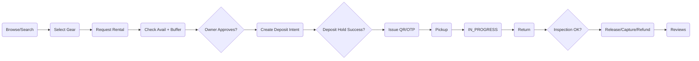
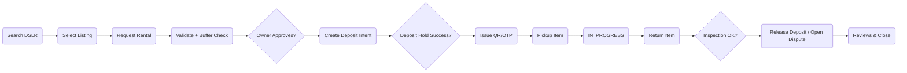
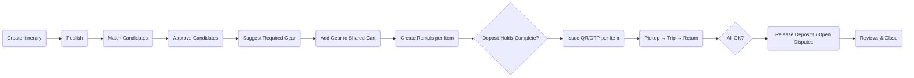
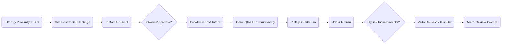
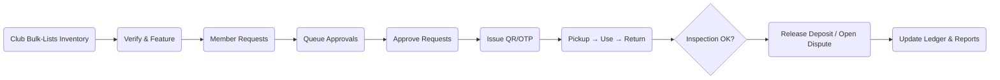
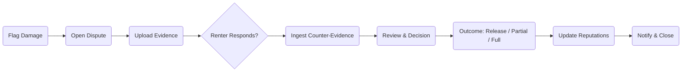
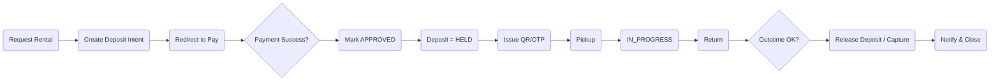
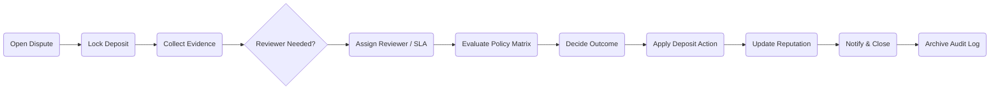

# CampusTrail — Mermaid Diagrams

```mermaid
%% 2.3.0 Generic Rental Flow
flowchart LR
  N0(Browse/Search)
  N1(Select Gear)
  N0 --> N1
  N2(Request Rental)
  N1 --> N2
  N3(Check Avail + Buffer)
  N2 --> N3
  N4{Owner Approves?}
  N3 --> N4
  N5(Create Deposit Intent)
  N4 --> N5
  N6{Deposit Hold Success?}
  N5 --> N6
  N7(Issue QR/OTP)
  N6 --> N7
  N8(Pickup)
  N7 --> N8
  N9(IN_PROGRESS)
  N8 --> N9
  N10(Return)
  N9 --> N10
  N11{Inspection OK?}
  N10 --> N11
  N12(Release/Capture/Refund)
  N11 --> N12
  N13(Reviews)
  N12 --> N13
```

```mermaid
%% 2.3.1 Fest DSLR Rental
flowchart LR
  N0(Search DSLR)
  N1(Select Listing)
  N0 --> N1
  N2(Request Rental)
  N1 --> N2
  N3(Validate + Buffer Check)
  N2 --> N3
  N4{Owner Approves?}
  N3 --> N4
  N5(Create Deposit Intent)
  N4 --> N5
  N6{Deposit Hold Success?}
  N5 --> N6
  N7(Issue QR/OTP)
  N6 --> N7
  N8(Pickup Item)
  N7 --> N8
  N9(IN_PROGRESS)
  N8 --> N9
  N10(Return Item)
  N9 --> N10
  N11{Inspection OK?}
  N10 --> N11
  N12(Release Deposit / Open Dispute)
  N11 --> N12
  N13(Reviews & Close)
  N12 --> N13
```

```mermaid
%% 2.3.2 Trekking Group Formation
flowchart LR
  N0(Create Itinerary)
  N1(Publish)
  N0 --> N1
  N2(Match Candidates)
  N1 --> N2
  N3(Approve Candidates)
  N2 --> N3
  N4(Suggest Required Gear)
  N3 --> N4
  N5(Add Gear to Shared Cart)
  N4 --> N5
  N6(Create Rentals per Item)
  N5 --> N6
  N7{Deposit Holds Complete?}
  N6 --> N7
  N8(Issue QR/OTP per Item)
  N7 --> N8
  N9(Pickup → Trip → Return)
  N8 --> N9
  N10{All OK?}
  N9 --> N10
  N11(Release Deposits / Open Disputes)
  N10 --> N11
  N12(Reviews & Close)
  N11 --> N12
```

```mermaid
%% 2.3.3 Last-Minute Tripod
flowchart LR
  N0(Filter by Proximity + Slot)
  N1(See Fast-Pickup Listings)
  N0 --> N1
  N2(Instant Request)
  N1 --> N2
  N3{Owner Approves?}
  N2 --> N3
  N4(Create Deposit Intent)
  N3 --> N4
  N5(Issue QR/OTP Immediately)
  N4 --> N5
  N6(Pickup in ≤30 min)
  N5 --> N6
  N7(Use & Return)
  N6 --> N7
  N8{Quick Inspection OK?}
  N7 --> N8
  N9(Auto-Release / Dispute)
  N8 --> N9
  N10(Micro-Review Prompt)
  N9 --> N10
```

```mermaid
%% 2.3.4 Club Gear Pool
flowchart LR
  N0(Club Bulk-Lists Inventory)
  N1(Verify & Feature)
  N0 --> N1
  N2(Member Requests)
  N1 --> N2
  N3(Queue Approvals)
  N2 --> N3
  N4(Approve Requests)
  N3 --> N4
  N5(Issue QR/OTP)
  N4 --> N5
  N6(Pickup → Use → Return)
  N5 --> N6
  N7{Inspection OK?}
  N6 --> N7
  N8(Release Deposit / Open Dispute)
  N7 --> N8
  N9(Update Ledger & Reports)
  N8 --> N9
```

```mermaid
%% 2.3.5 Damage Dispute Resolution
flowchart LR
  N0(Flag Damage)
  N1(Open Dispute)
  N0 --> N1
  N2(Upload Evidence)
  N1 --> N2
  N3{Renter Responds?}
  N2 --> N3
  N4(Ingest Counter-Evidence)
  N3 --> N4
  N5(Review & Decision)
  N4 --> N5
  N6(Outcome: Release / Partial / Full)
  N5 --> N6
  N7(Update Reputations)
  N6 --> N7
  N8(Notify & Close)
  N7 --> N8
```

```mermaid
%% 2.4.1 Deposit Hold/Capture/Release
flowchart LR
  N0(Request Rental)
  N1(Create Deposit Intent)
  N0 --> N1
  N2(Redirect to Pay)
  N1 --> N2
  N3{Payment Success?}
  N2 --> N3
  N4(Mark APPROVED)
  N3 --> N4
  N5(Deposit = HELD)
  N4 --> N5
  N6(Issue QR/OTP)
  N5 --> N6
  N7(Pickup)
  N6 --> N7
  N8(IN_PROGRESS)
  N7 --> N8
  N9(Return)
  N8 --> N9
  N10{Outcome OK?}
  N9 --> N10
  N11(Release Deposit / Capture)
  N10 --> N11
  N12(Notify & Close)
  N11 --> N12
```

```mermaid
%% 2.4.2 Dispute Resolution Flow
flowchart LR
  N0(Open Dispute)
  N1(Lock Deposit)
  N0 --> N1
  N2(Collect Evidence)
  N1 --> N2
  N3{Reviewer Needed?}
  N2 --> N3
  N4(Assign Reviewer / SLA)
  N3 --> N4
  N5(Evaluate Policy Matrix)
  N4 --> N5
  N6(Decide Outcome)
  N5 --> N6
  N7(Apply Deposit Action)
  N6 --> N7
  N8(Update Reputation)
  N7 --> N8
  N9(Notify & Close)
  N8 --> N9
  N10(Archive Audit Log)
  N9 --> N10
```

